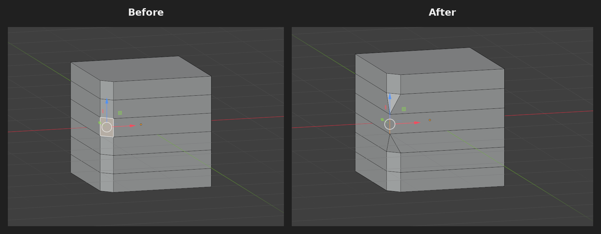

# Restore Bevel Edge

A Blender add-on that reconstructs the original sharp edge from already-applied bevel geometry.

**Version:** 1.2.3  
**Blender:** 5.2+

## Features

- Restore an applied bevel from a selected bevel face.
- Restore a bevel strip from a boundary edge or connected edge chain.
- Restore a bevel strip from 2 or more connected boundary vertices.
- Restore a local bevel point from a single selected boundary vertex.
- Reconstructs the original edge from the intersection of the adjacent face planes.
- Supports Undo.
- Localized menu labels, status messages, and error messages for English and Japanese Blender interfaces.

## Installation

1. Download `restore_bevel_edge.py` from this repository.
2. Open Blender.
3. Go to **Edit > Preferences > Add-ons**.
4. Open the Add-ons menu and choose **Install from Disk**.
5. Select the downloaded `restore_bevel_edge.py` file.
6. Enable **Restore Bevel Edge** in the Add-ons list.

After installation, the command is available from the right-click context menu in Mesh Edit Mode.

## Usage

1. Select a mesh object.
2. Enter **Edit Mode**.
3. Switch to Face, Edge, or Vertex Select mode and select the bevel geometry you want to restore.
4. Right-click in the 3D Viewport.
5. Choose **Restore Bevel Edge**.

### Face Select

Select exactly one bevel face.

### Edge Select

Select one boundary edge, or a continuous non-branching edge chain along one side of the bevel.

### Vertex Select

- Select one boundary vertex to restore the bevel locally at that point.
- Select 2 or more connected boundary vertices to restore a bevel strip.

## How it works

Restore Bevel Edge estimates the original sharp edge by finding the intersection line of the two adjacent original face planes. The bevel geometry is then projected and welded back onto that reconstructed line.

## Limitations

The surrounding topology must still contain enough information to reconstruct the original adjacent planes. Highly modified, ambiguous, degenerate, or non-manifold topology may not be recoverable automatically.

## License

Copyright © 2026 STUDIO WAKABA

This project is licensed under the GNU General Public License v3.0. See [LICENSE](LICENSE) for details.

---

## 日本語

**Restore Bevel Edge** は、Blenderで適用済みのベベル形状から、元の鋭いエッジを復元するためのアドオンです。

**バージョン:** 1.2.3  
**対応Blender:** 5.2+

### 主な機能

- ベベル面を1面選択して復元
- ベベル片側の境界エッジ／連続エッジから復元
- ベベル片側の連続頂点から復元
- 頂点を1つだけ選択して、その位置だけ局所的に復元
- 元の2面の交線を計算してエッジを再構築
- Undo対応
- Blenderの表示言語に応じて、メニュー・成功メッセージ・エラーメッセージを英語／日本語で表示

### インストール方法

1. このリポジトリから `restore_bevel_edge.py` をダウンロードします。
2. Blenderを起動します。
3. **編集（Edit） > プリファレンス（Preferences） > アドオン（Add-ons）** を開きます。
4. アドオン画面のメニューから **ディスクからインストール（Install from Disk）** を選択します。
5. ダウンロードした `restore_bevel_edge.py` を選択します。
6. アドオン一覧で **Restore Bevel Edge** を有効にします。

インストール後は、メッシュの編集モードで右クリックしたときのコンテキストメニューから実行できます。

### 使い方

1. メッシュオブジェクトを選択します。
2. **編集モード（Edit Mode）** に入ります。
3. Face / Edge / Vertex のいずれかの選択モードに切り替え、元に戻したいベベル形状を選択します。
4. 3Dビューで右クリックします。
5. **「ベベルを元のエッジに戻す」** を実行します。

#### 面選択（Face Select）

ベベル面を1枚だけ選択します。

#### 辺選択（Edge Select）

ベベル片側の境界エッジを1本、または分岐していない連続した境界エッジ列を選択します。

#### 頂点選択（Vertex Select）

- 境界頂点を1つ選択すると、その位置のベベルだけを局所的に復元します。
- ベベル片側の連続した境界頂点を2つ以上選択すると、ベベル列を復元します。

周囲の面情報から元のエッジを推定するため、トポロジーが大きく変更されている場合や、元の面を特定できない形状では正しく復元できないことがあります。
